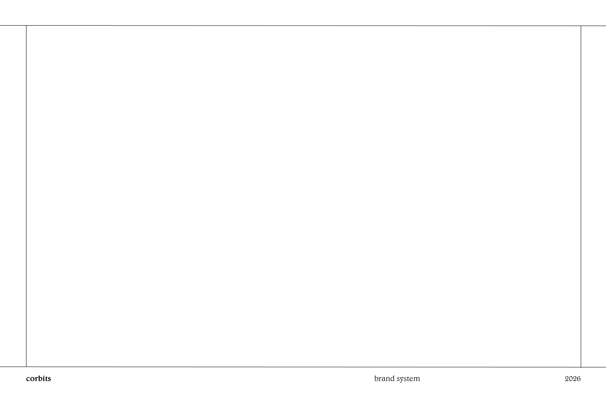
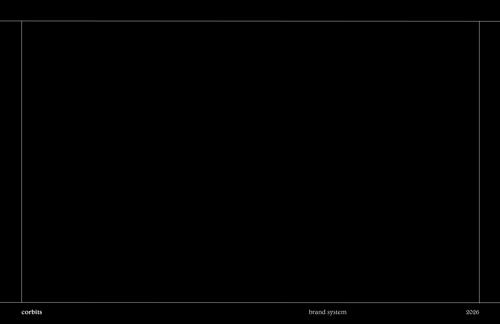

# Brand Templates

---

## Slide Formats

Two base formats available:

| Format | Background | Text Color | Use |
|--------|-----------|------------|-----|
| format/white | White | Black | Default presentation slides |
| format/black | Black | White | Dark variant slides |

### White Format

### Black Format

Both include the standard footer: "corbits" (left, Belwe Lt BT Medium) | "brand system" (center, Belwe Lt BT Light) | "2026" (right, Belwe Lt BT Light).

---

## Content Template (template-01)

Standard content slide layout:

- **Slide number:** Red Hat Display Regular, 48px (left of divider line)
- **Title:** Red Hat Display Black, 48px (right of divider line)
- **Body text:** Red Hat Display Regular, 24px (Body Medium), line-height 1.3
- **Category label:** Red Hat Display Bold, 20px (Caption), letter-spacing 4px, uppercase
- **Divider line:** Horizontal rule separating header from content area

---

## Brand Design References

- [How to Brand Your Company](https://x.com/scott_baio/status/2043596395580670401) — @scott_baio thread on X
